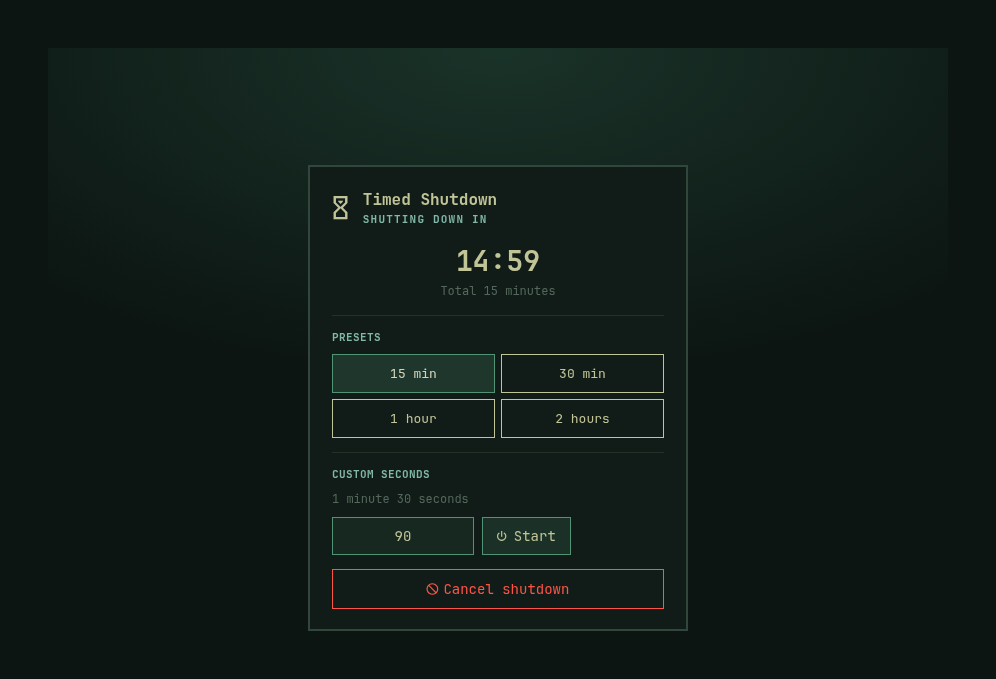

# Timed Shutdown

An Omarchy bar plugin that shuts this computer down after a countdown.



> [!IMPORTANT]
> This plugin is for **Omarchy 4 (Quattro)**, where the desktop shell and bar
> use [Quickshell](https://quickshell.org/).

## What it does

- 15 minutes, 30 minutes, 1 hour, and 2 hours as one-click presets
- Any custom duration in seconds (1–86400)
- Live countdown on the bar and in the panel
- Cancel from the panel, or with a right-click on the bar icon
- A user systemd timer still fires if the shell restarts
- **Disable notifications** is on by default; turn it off in the panel for start, 60s/10s, and cancel alerts

When the timer ends it runs `omarchy system shutdown`, which closes windows
and then powers off.

## Install

Review the repository, then add the plugin:

```bash
omarchy plugin add https://github.com/Henri1130/omarchy-timed-shutdown.git
```

Accept the prompt to enable the plugin during installation.

For an unattended install from a repository you already trust:

```bash
omarchy plugin add https://github.com/Henri1130/omarchy-timed-shutdown.git --enable --yes
```

## Use

Left-click the timer icon in the bar. Choose a preset, or type a duration in
seconds with the number row or numpad and press **Start**. The field arrows
still step the value. **Cancel shutdown** stops a running timer; you can also
right-click the bar icon.

From a terminal:

```bash
omarchy-shell henri.timed-shutdown start 90
omarchy-shell henri.timed-shutdown status
omarchy-shell henri.timed-shutdown cancel
omarchy-shell henri.timed-shutdown.panel toggle
```

## Update

```bash
omarchy plugin update henri.timed-shutdown
```

Or update all Git-managed plugins:

```bash
omarchy plugin update --all
```

## Disable

```bash
omarchy plugin disable henri.timed-shutdown
```

## Uninstall

```bash
omarchy plugin remove henri.timed-shutdown
```

## Validate from source

```bash
omarchy plugin validate .
node --test tests/model.test.js
```

## Security

This plugin runs unsandboxed inside `omarchy-shell` when enabled. Review its
source before installing it.

It does:

- Schedule and cancel a user systemd timer named `henri-timed-shutdown`.
  The backup timer is `systemd-run` / `systemctl` argv (no shell), and
  always runs `/usr/share/omarchy/bin/omarchy-system-shutdown`. Start
  and cancel are serialized: cancel waits for every in-flight scheduler
  to exit, a stale schedule cannot keep a timer while inactive, and a
  newer start is applied only after an older stop finishes.
- Run `omarchy-system-shutdown` when the countdown reaches zero
- Send desktop notifications for start, 60s/10s warnings, and cancel
- Read and write `$XDG_RUNTIME_DIR/henri.timed-shutdown.json` so a shell
  reload can restore an in-progress countdown. Restore opens that path
  nonblocking, requires a regular file, and reads at most 4KiB.

It does not access the network or change Hyprland config.

## License And Warranty

Licensed under the [MIT License](LICENSE).

The software is provided **as is, without warranty of any kind**, express or
implied. See the license for the complete warranty and liability disclaimer.
